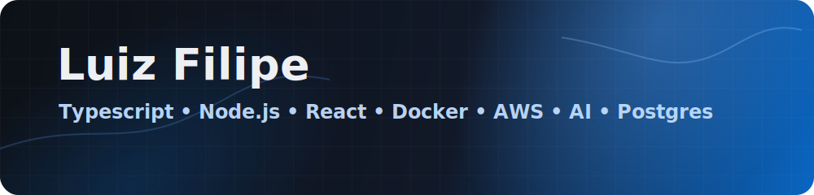

  

I build web and mobile products with React Native, Next.js, TypeScript, Node.js and PostgreSQL. Most of my work sits around health, education and operations: messy workflows, internal tools, mobile releases and AI features that need a real reason to exist.

At S_line, I work on React Native apps, APIs and release pipelines.

## GitHub dashboard

  
  

  

## Stack I use

  

## Contact

I am open to full stack, mobile and applied AI work. Portuguese native, English C1.

  
  
  

